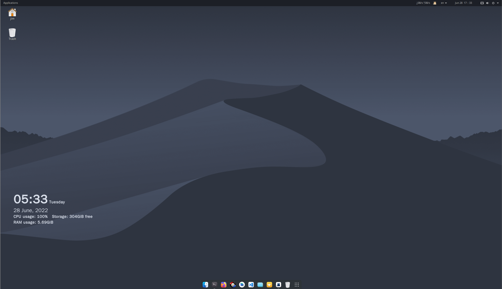

# GNOME Nord Theme

### Screen Capture


### Step 1. 安装 gnome-tweaks

`sudo apt install gnome-tweaks`

### Step 2. 为浏览器安装gnome-shell-extension

`https://extensions.gnome.org`


### Step 3. Install Theme Plugin via GNOME Store
> GNOME Store - `https://www.gnome-look.org/browse/`

- Colloid GTK Theme
    - `https://gnome-look.org/p/1661959`
    - `https://github.com/vinceliuice/Colloid-gtk-theme`
- Big Sur Icons
    - `https://gnome-look.org/p/1400021`

- Nord Curser
    - gnome-look.org/p/1571931

### Step 4. new Folder under $HOME
- `.themes`
- `.icons`

### Step 5. more Gnome Extensions
- Frippery Move Clock
- Frippery Applications Menu
- Remove App Menu
- Dash to Dock

### Step 6. Nord Theme & Nord Wallpaper
- Wallpaper
    - `https://imgur.com/gallery/ZE9ZvL4`

- Firefox
    - Nord Theme

### Step 7. Conky & Conky-Clock

- `sudo apt install conky`
- `https://github.com/junaidrahim/conky-clock`
- edit - /etc/conky/conky.conf

```
# Modify properties
default_color='#d8dee9'
color0='#d8dee9'
color1='#d8dee9'
```

### Step 8.  install `Segoe UI Light Font`
- Product Sans -> Segoe UI Light

